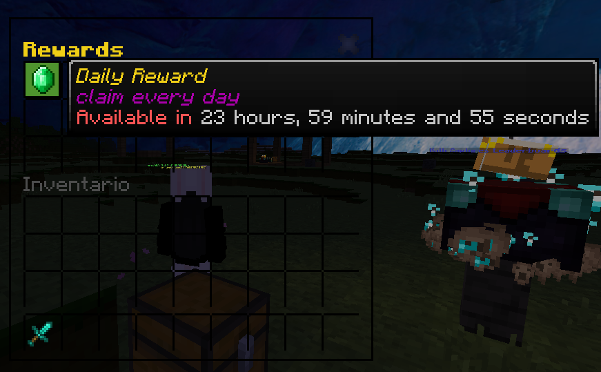

# AdvancedRewards

**AdvancedRewards is a PocketMine-MP plugin to add rewards to your Factions server.**

<p align="center"></p>

## Prerequisites

- InvMenu virion
- PMMP 5.3.0+

## Installation & Setup

1. Install the plugin from [Poggit](https://poggit.pmmp.io/ci/RxDuZ/AdvancedRewards/~).
2. (Optional) Configure `config.yml` sounds, broadcast and command.
3. Configure `categories.yml` Define the name of the category in the key.
   - `customname`: The custom name of the category that will appear in the Menu.
   - `description`: Description that will appear in the Menu.
   - `slot`: Slot that occupies its representative Item in the Inventory Menu.
   - `representative-item`: Name of the item that represents this category.
4. Configure `rewards.yml` Configure unlimited rewards, it is important to first create the category in which each reward will be.
   - `customname`: The custom name of the reward that will appear in the Menu.
   - `description`: Description that will appear in the Menu.
   - `category`: Category it will be in (The category must exist)
   - `slot`: Slot that occupies its representative Item in the Inventory Menu.
   - `representative-item`: Name of the item that represents this reward.
   - `commands`: List of commands (array) that the console executes when claiming the reward (Use {PLAYER} for the player name)
   - `cooldown`: Cooldown time to claim again (in seconds)
   - `permission`: Permission to claim.

### Implementations

- [x] Categories
- [x] Multiple rewards
- [x] Custom permissions
- [x] Custom messages
- [x] Sounds
- [x] Configurable command

---

### 💾 Config

```yml
#     ▄████████ ████████▄   ▄█    █▄     ▄████████ ███▄▄▄▄    ▄████████    ▄████████ ████████▄     ▄████████    ▄████████  ▄█     █▄     ▄████████    ▄████████ ████████▄     ▄████████
#    ███    ███ ███   ▀███ ███    ███   ███    ███ ███▀▀▀██▄ ███    ███   ███    ███ ███   ▀███   ███    ███   ███    ███ ███     ███   ███    ███   ███    ███ ███   ▀███   ███    ███
#    ███    ███ ███    ███ ███    ███   ███    ███ ███   ███ ███    █▀    ███    █▀  ███    ███   ███    ███   ███    █▀  ███     ███   ███    ███   ███    ███ ███    ███   ███    █▀
#    ███    ███ ███    ███ ███    ███   ███    ███ ███   ███ ███         ▄███▄▄▄     ███    ███  ▄███▄▄▄▄██▀  ▄███▄▄▄     ███     ███   ███    ███  ▄███▄▄▄▄██▀ ███    ███   ███
#  ▀███████████ ███    ███ ███    ███ ▀███████████ ███   ███ ███        ▀▀███▀▀▀     ███    ███ ▀▀███▀▀▀▀▀   ▀▀███▀▀▀     ███     ███ ▀███████████ ▀▀███▀▀▀▀▀   ███    ███ ▀███████████
#    ███    ███ ███    ███ ███    ███   ███    ███ ███   ███ ███    █▄    ███    █▄  ███    ███ ▀███████████   ███    █▄  ███     ███   ███    ███ ▀███████████ ███    ███          ███
#    ███    ███ ███   ▄███ ███    ███   ███    ███ ███   ███ ███    ███   ███    ███ ███   ▄███   ███    ███   ███    ███ ███ ▄█▄ ███   ███    ███   ███    ███ ███   ▄███    ▄█    ███
#    ███    █▀  ████████▀   ▀██████▀    ███    █▀   ▀█   █▀  ████████▀    ██████████ ████████▀    ███    ███   ██████████  ▀███▀███▀    ███    █▀    ███    ███ ████████▀   ▄████████▀
#                                                                                                 ███    ███                                         ███    ███
# AdvancedRewards made by iRxDuZ

# Do not touch :)
CONFIG_VERSION: 1

# Find sounds here: https://www.digminecraft.com/lists/sound_list_pe.php
# Sound when claiming a reward
reward-claim-sound: "random.levelup"

# Sound when failing to claim a reward
reward-failed-sound: "note.bassattack"

# Broadcast message to claim rewards
# Custom message in /messages.yml
broadcast-claim-rewards: true

# Reward command configuration
command:
  name: "reward"
  description: "Claim your rewards"
  aliases: ["reclaim", "daily"]
```

### 💾 Categories

```yml
user:
  customname: "&l&aUser"
  description: "&aRewards for all users"
  slot: 0
  representative-item: "paper"
premium:
  customname: "&l&bPremium"
  description: "&aRewards for premium users"
  slot: 2
  representative-item: "paper"
```

### 💾 Rewards

```yml
daily:
  customname: "&gDaily Reward"
  description: "&eclaim every day\n&r{STATUS}"
  category: user
  slot: 0
  representative-item: "emerald"
  commands:
    - "give {PLAYER} diamond_sword 1"
  cooldown: 86400
  permission: "reward.daily.claim"
weekly:
  customname: "&gWeekly Reward"
  description: "&eClaim every week\n&r{STATUS}"
  category: user
  slot: 2
  representative-item: "emerald"
  commands:
    - "give {PLAYER} golden_apple 16"
  cooldown: 604800
  permission: "reward.weekly.claim"
monthly:
  customname: "&gMonthly Reward"
  description: "&eClaim every month\n&r{STATUS}"
  category: user
  slot: 4
  representative-item: "emerald"
  commands:
    - "give {PLAYER} diamond 64"
  cooldown: 2592000
  permission: "reward.monthly.claim"
vip:
  customname: "&gVip Reward"
  description: "&eAvailable every day for premium users\n&r{STATUS}"
  category: premium
  slot: 0
  representative-item: "diamond"
  commands:
    - "give {PLAYER} diamond 64"
    - "give {PLAYER} emerald 64"
    - "givemoney {PLAYER} 10000"
  cooldown: 86400
  permission: "reward.vip.claim"
```

## Permissions

| Permissions          | Description                  | Default |
| -------------------- | ---------------------------- | ------- |
| `reward.command.use` | Allow to use /reward command | `true`  |

### ✔ Credits

| Authors | Github                              | Lib                                          |
| ------- | ----------------------------------- | -------------------------------------------- |
| Muqsit  | [Muqsit](https://github.com/Muqsit) | [InvMenu](https://github.com/Muqsit/InvMenu) |
